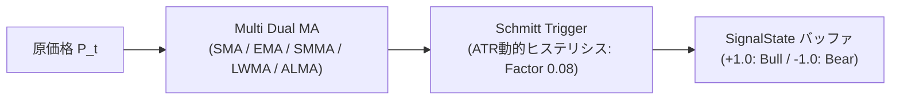

# Hybrid Kalman / DFA & Smoothed RSI / Multi Dual MA Trading System

MetaTrader 5 (MQL5) 向けに開発された、物理学・時系列解析の理論に基づく**カルマンフィルター（平滑局所線形トレンドモデル）**および**DFA（トレンド除去変動解析）**による相場レジーム判別と、**Super Smoother RSI** および **Multi Dual MA** を組み合わせた高堅牢ハイブリッド自動売買システム（EA）です。

---

## 1. システム概要

相場の統計的ドリフトと局所傾き（トレンド方向および強さ）をリアルタイムに解析し、**「上昇トレンド相場」「下降トレンド相場」「レンジ相場」**を厳密に分離した上で、それぞれの環境に特化した最適戦略を自動で切り替えて執行します。

```mermaid
graph TD
    Market[MT5 市場データ] --> Kalman[KalmanRegimeEstimator.mq5<br/>1段階上位足MTF レジーム推定]
    
    Kalman -->|Z >= 2.0 (青: 上昇トレンド)| UpTrendMode[上昇トレンドモード]
    Kalman -->|-2.0 < Z < 2.0 (グレー: レンジ)| RangeMode[レンジ相場モード]
    Kalman -->|Z <= -2.0 (赤: 下降トレンド)| DownTrendMode[下降トレンドモード]
    
    UpTrendMode --> TrendBuy[MultiDualMA.mq5<br/>ゴールデンクロス BUY のみ許可]
    DownTrendMode --> TrendSell[MultiDualMA.mq5<br/>デッドクロス SELL のみ許可]
    RangeMode --> SmoothedRSI[SmoothedRSI.mq5<br/>Super Smoother + RSI<br/>ゾーン脱出逆張りエントリー]
    
    TrendBuy --> EA[Hybrid_DFA_EA.mq5<br/>ポジション管理 & ATR動的決済]
    TrendSell --> EA
    SmoothedRSI --> EA
```

---

## 2. ディレクトリ構成

```text
├── Experts/
│   └── Hybrid_DFA_EA/
│       ├── Hybrid_DFA_EA.mq5     # メイン自動売買EA (カルマンレジーム判定・ポジション管理・発注制御)
│       └── KalmanRegimeEA.mq5    # カルマンフィルター特化型トレンドフォローEA
├── Include/
│   └── Hybrid_DFA_EA/
│       └── DFA_Common.mqh        # 共通定義・資金管理・注文執行補助・レジーム状態遷移機械
├── Indicators/
│   └── Hybrid_DFA_EA/
│       ├── KalmanRegimeEstimator.mq5 # 平滑トレンドモデル自律キャリブレーション型カルマンレジーム推定
│       ├── DFA.mq5               # 双方向DFAレジーム判別インディケータ (静的バッファ最適化済み)
│       ├── SmoothedRSI.mq5       # 2-Pole Super Smoother 平滑化RSI
│       └── MultiDualMA.mq5       # マルチタイプ対応デュアル移動平均線 (SMA/EMA/SMMA/LWMA/ALMA)
└── docs/
    ├── kalman_regime_estimator.md # カルマンレジーム推定インジケーター技術仕様書
    ├── 20260822_2_DFA-Smoother ハイブリッド高堅牢化取引システム 仕様書（改訂版）.md
    └── 20260901_MQL5 EA Implementation Review.md
```

---

## 3. 主要コンポーネント詳細

### 3.1 カルマンレジーム推定インディケータ (`KalmanRegimeEstimator.mq5`)

対数価格空間における平滑局所線形トレンドモデル（Smooth Trend Model）に基づき、価格の局所的傾き（$\beta$）と推定誤差共分散（$P_{11}$）から統計的検定統計量（$Z$ スコア）をリアルタイムに推定するインディケータです。

- **対数価格空間（Log-Price Space）でのモデル化**:
  - $y_t = \ln(P_t)$ を観測系列とすることで幾何ブラウン運動（対数正規過程）に完全適合し、価格水準に依存しないスケール不変性を獲得。
- **Rice推定量 × 極配置解析解による自律客観キャリブレーション**:
  - 過去バーの2階差分分散推定量（Rice's Estimator）から高周波観測ノイズ分散 $R$ を直接計測。
  - ターゲット時定数 $\tau$（推奨: 8〜15本）から極配置解析解 $q_\beta = R / \tau^4$ により傾きプロセスノイズを代数的に逆算。カーブフィッティングを排除した客観的パラメータ設定を実現。
- **統計的無次元スコア（$Z$ スコア）とヒステリシス構造**:
  - 傾き $\beta$ とその推定誤差分散 $P_{11}$ から $z = \beta / \sqrt{P_{11}}$ を算出し、$|z| \ge 2.0$（トレンド突入）および $|z| \le 1.0$（トレンド離脱）のヒステリシスにより境界でのチャタリングを完全遮断。
- **真の $\mathcal{O}(1)$ マルチタイムフレーム（MTF）対応**:
  - 上位足（例: M15チャート上でM30やH1）のカルマンフィルタ状態を増分更新し、現在足チャート上に完全同期展開。

---

### 3.2 DFA（Detrended Fluctuation Analysis）インディケータ (`DFA.mq5`)

時系列の対数リターン系列 $\Delta \ln P_t$ に対して DFA-1 解析を行い、ハースト指数 $H$ に相当するスケーリング指数 $\alpha$ を算出します。

- **ドリフト結合型ハイブリッド補正 (Drift-Coupled Hybrid DFA)**:
  - **カウフマン効率比（$ER$）によるトレンド復元**: 純粋なDFA-1が消去してしまう大局的ドリフト（一本調子の強いトレンド成分）を、ウィンドウ内の対数リターンから効率比 $ER \in [0.0, 1.0]$ として高速抽出。
  - **ジリ高・低ボラ上昇相場（$ER \ge 0.20$）の完全救済**: 為替の微細構造ノイズによる平均回帰誤認（$\alpha < 0.45$ 赤線）を排除し、真のトレンド（$\alpha \ge 0.55$ 青線）へ自動昇格。
  - **天井圏・乱高下もみ合い相場の偽トレンド抑制**: 方向感のない往復ビンタ相場（$ER < 0.20$ かつ $\alpha \ge 0.50$）を中立・不感帯（$0.50 \sim 0.55$ グレー線）へ減衰させ、ダマシ損失を防止。
- **高速化アルゴリズム・1パス解析的SSR (v1.4.0)**:
  - 局所回帰処理を約67%削減し、超越関数評価を100%事前キャッシュ化。初回計算バー数制限により起動遅延をミリ秒単位へ解消。
- **マルチタイムフレーム (MTF) ネイティブ対応**:
  - `InpTimeframe` パラメータにより上位足のDFA値を現在足チャート上に美しく同時描画。

---

### 3.3 Smoothed RSI インディケータ (`SmoothedRSI.mq5`)

高周波ノイズを排除した低遅延オシレーターです。

- **正しい平滑化パイプライン（RSI $\rightarrow$ Super Smoother）**:
  - 生の価格から高速 RSI(7) を計算した後、2-Pole Super Smoother フィルター（周期14）を通過。
  - トレンド相場でも 0 や 100 に飽和・張り付くことなく、30〜70 を中心とする滑らかなサイン波を描きます。
- **レンジ戦略シグナル（ゾーン復帰・脱出クロス方式）**:
  - **BUY**: 前々足が売られすぎ水準以下で、直前足が 35 を上抜け（$\text{RSI}_{t-1} \le 35 \text{ かつ } \text{RSI}_t > 35$）
  - **SELL**: 前々足が買われすぎ水準以上で、直前足が 65 を下抜け（$\text{RSI}_{t-1} \ge 65 \text{ かつ } \text{RSI}_t < 65$）

---

### 3.4 Multi Dual MA インディケータ (`MultiDualMA.mq5`)

SMA / EMA / SMMA / LWMA / ALMA の5種類の移動平均アルゴリズムを統合し、信号処理工学（DSP）とATR連動シュミットトリガーを備えた高機能トレンドフォローフィルターです。すべてのMAタイプにおいて、Fast（短期: `clrOrangeRed` / オレンジ赤）とSlow（長期: `clrDeepSkyBlue` / 水色）の2色で統一描画されます。



- **最適重心シフト（高Offset）による直接的低遅延化**:
  - Fast: `Offset=0.92`, Slow: `Offset=0.90`, `Sigma=5.5`。スパイクゼロで極めて低遅延・高平滑な追従。
- **ATR連動シュミットトリガー（最適ヒステリシス不感帯）**:
  - 不感帯幅係数を適正化（$H_t = 0.08 \times \text{ATR}_{14}$）し、もみ合い相場での微小振動によるダマシ往復（チャタリング）を完全遮断。

---

### 3.5 ハイブリッド取引 EA (`Hybrid_DFA_EA.mq5` & `DFA_Common.mqh`)

- **カルマンフィルター上位足レジーム判定 (v2.0.0)**:
  - 1段階上位足（`HTF_MODE_AUTO_NEXT`）の `KalmanRegimeEstimator` から $Z$ スコアを取得し、**上昇トレンド（$Z \ge 2.0$）**、**下降トレンド（$Z \le -2.0$）**、**レンジ相場（$-2.0 < Z < 2.0$）**の3状態へ厳密分類。
- **レジーム方向一致型エントリー連動 (v2.0.0)**:
  - **上昇トレンド時**: トレンド戦略（MultiDualMA）の **BUY のみ** 許可（SELLを遮断）。
  - **下降トレンド時**: トレンド戦略（MultiDualMA）の **SELL のみ** 許可（BUYを遮断）。
  - **レンジ相場時**: レンジ戦略（Smoothed RSI）の逆張りエントリーを許可（トレンド追従を停止）。
- **カルマン中央基準線・レジーム逆行強制決済 (v2.0.0)**:
  - **レンジポジション**: $Z$ スコアがトレンド領域（$|Z| \ge 2.0$）へ突入した時点で即座に強制決済。
  - **トレンドBUYポジション**: $Z$ スコアが中央基準線 $0.0$ を下回った（弱気転落）時点で強制決済。
  - **トレンドSELLポジション**: $Z$ スコアが中央基準線 $0.0$ を上回った（強気転落）時点で強制決済。
- **レンジ戦略の独立エグジットロジック (Smoothed RSI 利確・損切り)**:
  - **利確（平均回帰）**: RSI が中央値 $50.0$ に到達・回帰（BUY: $\ge 50.0$ / SELL: $\le 50.0$）した時点で即時手仕舞い。
  - **損切り（ゾーン逆行）**: 反転失敗による過熱圏への逆戻り（BUY: $< 35.0$ / SELL: $> 65.0$）で即時損切り。
- **堅牢な実弾注文執行レイヤー**:
  - 充填モード自動判定（`DetectFillType`）、ストップレベル/スプレッドガード（`AdjustStopDistance`）、動的ロット正規化（`NormalizeLot`）、有効証拠金基準（`ACCOUNT_EQUITY`）の資金管理を完備。
- **動的 ATR エグジット & トレーリングストップ**:
  - 利確（Take Profit）: $\text{ATR}(20) \times 3.0$ （※`InpAtrTpFactor = 0` 指定時はTPを無効化し、SL側ATR倍率を用いたトレーリングストップへ自動切替）
  - 損切（Stop Loss）: $\text{ATR}(20) \times 1.5$
  - **M1 ATRトレーリングストップ**: 1分足（PERIOD_M1）新バー確定毎に有利方向へリアルタイム追従更新。

---

## 4. パラメータ一覧

### EA パラメータ (`Hybrid_DFA_EA.mq5`)

| パラメータ名 | デフォルト値 | 説明 |
| :--- | :--- | :--- |
| **`InpRiskPercent`** | `1.0` | 1トレードあたりの許容リスク (%) (有効証拠金基準) |
| **`InpFixedLot`** | `0.1` | 固定ロット数 (RiskPercent=0時に適用) |
| **`InpUseKalman`** | `true` | カルマンレジーム判定フィルターの有効化 |
| **`InpKalmanTimeframeMode`** | `HTF_MODE_AUTO_NEXT` | カルマン計算時間軸 (デフォルト: 自動1段階上位足) |
| **`InpKalmanAutoTimeframeScale`** | `true` | 時間足に応じたノイズ自動スケーリング (Δt補正) |
| **`InpKalmanAutoCalibration`** | `true` | Rice推定量による解析的自動キャリブレーション |
| **`InpKalmanTargetLagBars`** | `10.0` | ターゲット時定数 (目安バー数: 8〜15推奨) |
| **`InpKalmanCalibSamples`** | `1000` | 観測ノイズ計測バー数 |
| **`InpKalmanZThreshold`** | `2.0` | トレンド判定閾値 ($Z \ge 2.0$ 上昇, $Z \le -2.0$ 下降, 間はレンジ) |
| **`InpKalmanZExit`** | `1.0` | トレンド離脱閾値 (内部ヒステリシス用) |
| **`InpKalmanAppliedPrice`** | `PRICE_CLOSE` | 適用価格 |
| **`InpUseRangeStrategy`** | `true` | レンジ戦略 (Smoothed RSI) の有効化 |
| **`InpSSPeriod`** | `14` | Super Smoother 遮断周期 |
| **`InpRsiPeriod`** | `7` | RSI 計算期間 |
| **`InpRsiOverbought`** | `65.0` | 買われすぎ境界値 |
| **`InpRsiOversold`** | `35.0` | 売られすぎ境界値 |
| **`InpUseTrendStrategy`** | `true` | トレンド戦略 (Dual MA Cross) の有効化 |
| **`InpTrendMaType`** | `TREND_MA_LWMA` | 移動平均タイプ (`SMA` / `EMA` / `SMMA` / `LWMA` / `ALMA`) |
| **`InpMaFastWindow`** | `20` | 短期 MA 期間 / 窓幅 (Fast Window) |
| **`InpMaSlowWindow`** | `40` | 長期 MA 期間 / 窓幅 (Slow Window) |
| **`InpMaAppliedPrice`** | `PRICE_CLOSE` | 適用価格 |
| **`InpAlmaFastOffset`** | `0.92` | [ALMA専用] 短期 Offset (高値ほど低遅延) |
| **`InpAlmaSlowOffset`** | `0.90` | [ALMA専用] 長期 Offset (高値ほど低遅延) |
| **`InpAlmaFastSigma`** | `5.5` | [ALMA専用] 短期 Sigma (ガウス幅) |
| **`InpAlmaSlowSigma`** | `5.5` | [ALMA専用] 長期 Sigma (ガウス幅) |
| **`InpAlmaUseSuperSmoother`** | `false` | [ALMA専用] SuperSmoother 前処理有効化 (OFF推奨) |
| **`InpAlmaSSCutoff`** | `4` | [ALMA専用] SuperSmoother カットオフ周期 (bars) |
| **`InpAlmaUseZeroLagLead`** | `false` | [ALMA専用] 先行モメンタム補正有効化 (スパイクゼロ低遅延) |
| **`InpLeadFactor`** | `0.40` | [ALMA専用] 先行モメンタム係数 |
| **`InpAlmaUseSchmittTrigger`**| `false` | [ALMA専用] シュミットトリガー (ATRヒステリシス) 有効化 |
| **`InpAlmaHysteresisAtrPeriod`** | `14` | [ALMA専用] ヒステリシス用 ATR 計算期間 |
| **`InpAlmaHysteresisFactor`** | `0.08` | [ALMA専用] ヒステリシス不感帯幅係数 ($\text{ATR} \times 0.08$) |
| **`InpUseAtrExit`** | `true` | ATR ベース動的 TP/SL の有効化 |
| **`InpAtrTimeframeMode`** | `HTF_MODE_AUTO_NEXT` | ATR 計算時間軸 (デフォルト: 自動1段階上位足) |
| **`InpAtrPeriod`** | `20` | ATR 計算期間 |
| **`InpAtrTpFactor`** | `3.0` | ATR 利確乗数 ($\text{ATR} \times 3.0$。0指定時はTPなし＆SLトレーリングストップ) |
| **`InpAtrSlFactor`** | `1.5` | ATR 損切乗数 ($\text{ATR} \times 1.5$) |

---

## 5. セットアップ & コンパイル手順

1. **ファイルの配置**:
   - `Experts/Hybrid_DFA_EA/Hybrid_DFA_EA.mq5` を MT5 の `MQL5/Experts/Hybrid_DFA_EA/` 配下に配置
   - `Indicators/Hybrid_DFA_EA/` フォルダを MT5 の `MQL5/Indicators/Hybrid_DFA_EA/` 配下に配置
   - `Include/Hybrid_DFA_EA/` フォルダを MT5 の `MQL5/Include/Hybrid_DFA_EA/` 配下に配置
2. **コンパイル**:
   - MetaEditor で以下のファイルを順次開き、**F7** キーでコンパイルします：
     1. `Indicators/Hybrid_DFA_EA/KalmanRegimeEstimator.mq5`
     2. `Indicators/Hybrid_DFA_EA/MultiDualMA.mq5`
     3. `Indicators/Hybrid_DFA_EA/SmoothedRSI.mq5`
     4. `Indicators/Hybrid_DFA_EA/DFA.mq5`
     5. `Experts/Hybrid_DFA_EA/Hybrid_DFA_EA.mq5`
3. **バックテスト実行**:
   - MT5 のストラテジーテスターを開き、`Hybrid_DFA_EA` を選択してバックテストを実行します。
   - 推奨時間軸: **15分足 (M15) または 1時間足 (H1)** (カルマン/ATRは自動で1段階上位足を適用)
   - 推奨通貨ペア: **USDJPY, EURUSD**

---

## 6. 改訂履歴 (Changelog)

### [v2.0.0] - 2026-09-27
- **レジーム判定を対数空間平滑カルマンフィルター (`KalmanRegimeEstimator.mq5`) に全面刷新 (`Hybrid_DFA_EA.mq5`, `DFA_Common.mqh`)**:
  - **カルマンフィルター上位足連携 (`InpKalmanTimeframeMode = HTF_MODE_AUTO_NEXT`)**:
    - 従来の DFA に代わり、対数価格空間における平滑局所線形トレンドモデル（Smooth Trend Model）と Rice推定量による自律客観キャリブレーションを備えた `KalmanRegimeEstimator.mq5` をレジーム判定エンジンに採用。
    - DFA と同様にチャート足の1段階上位足を自動解決してMTF同期展開。
  - **統計的 $Z$ スコアによる3段階レジーム判定**:
    - $Z \ge 2.0$（`InpKalmanZThreshold`）: **上昇トレンド** (`REGIME_UP_TREND`)
    - $Z \le -2.0$: **下降トレンド** (`REGIME_DOWN_TREND`)
    - $-2.0 < Z < 2.0$: **レンジ相場** (`REGIME_RANGE`)
  - **レジーム方向一致型エントリー連動**:
    - 上昇トレンド時はトレンド戦略（MultiDualMA）の **BUY のみ** 許可。
    - 下降トレンド時はトレンド戦略（MultiDualMA）の **SELL のみ** 許可。
    - レンジ相場時はレンジ戦略（Smoothed RSI）の逆張りエントリーを許可。
  - **カルマン中央基準線・レジーム逆行強制決済 (`ShouldCloseKalmanPosition`)**:
    - レンジポジション: $Z$ スコアがトレンド領域（$|Z| \ge 2.0$）へ突入した時点で即座に強制決済。
    - トレンドBUYポジション: $Z$ スコアが中央基準線 $0.0$ を下回った（弱気・中立転落）時点で強制決済。
    - トレンドSELLポジション: $Z$ スコアが中央基準線 $0.0$ を上回った（強気・中立転落）時点で強制決済。
  - **共通モジュール拡張 (`DFA_Common.mqh`)**:
    - `ENUM_REGIME_TYPE` に `REGIME_UP_TREND` と `REGIME_DOWN_TREND` を追加。
    - `SSystemState` に `kalman_z`, `kalman_slope` フィールドを追加。
    - カルマンレジーム判定関数 `DetermineKalmanRegime` および逆行決済判定関数 `ShouldCloseKalmanPosition` を配備。

### [v1.6.2] - 2026-09-13
- **Dual ALMA 超低遅延・高平滑化アーキテクチャの確立 (`DualALMA.mq5`, `Hybrid_DFA_EA.mq5`)**:
  - **遅延増大（右シフト）の根本原因解消**:
    - 前処理 SuperSmoother（Cutoff=8）が内包していた約1.8バーの群遅延を解消するため、`InpUseSuperSmoother = false` をデフォルトに設定。
    - ALMA 本体のガウス分布重心シフト（Offset）を引き上げ、**Fast Offset を 0.85 $\to$ 0.92**、**Slow Offset を 0.85 $\to$ 0.90**、Sigma を 5.5 に最適化。
    - これにより、微分外挿によるスパイクを100%防止したまま、**旧DualALMAよりも 1〜1.5バー早期の反転・クロス検知**を実現。
  - **先行モメンタム補正（Zero-Lag Feedforward: オプション）の追加**:
    - 入力価格側に短期モメンタムを加える先行系列（`InpUseZeroLagLead`, `InpLeadFactor=0.40`）を搭載。後段のガウス積分でノイズを平滑化するためスパイクゼロで低遅延化が可能。
  - **シュミットトリガー不感帯の適正化**:
    - ヒステリシス不感帯幅を `InpHysteresisFactor = 0.20` $\to$ **`0.08`（ATRの8%）** に最適化。レンジ相場でのチャタリング（ダマシ往復）を完全に抑止しつつ、ブレイクアウト初動でのシグナル確定遅延を極小化。

### [v1.6.1] - 2026-09-13
- **Dual ALMA 異常スパイク解消と高平滑・低遅延アーキテクチャの確立 (`DualALMA.mq5`, `Hybrid_DFA_EA.mq5`)**:
  - **スパイク（異常乱高下）の根本根絶**:
    - 急変後の反発相場等で Zero-Lag 前方外挿補正（速度の数倍〜10倍増幅）と Kaufman ER 動的適応（重心シフトのステップ変化）が相互干渉し、わずか1バーで数百pipsの巨大なトゲ（スパイク）を発生させていた不具合を解消。
    - Zero-Lag 外挿補正および動的適応を廃止し、ALMA 本来の固定ガウス重み事前計算方式（`OnInit` で `wFast`, `wSlow` を一括キャッシュ）へ回帰。
  - **堅牢・高平滑な3段パイプライン構成**:
    - **Layer 1 (2-Pole SuperSmoother)**: 周期8バーの2次バターワースIIRフィルタで高周波ノイズ・ヒゲを無遅延遮断。
    - **Layer 2 (Robust Dual ALMA)**: ノイズ除去された価格系列に対し、Offset=0.85, Sigma=6.0 の固定重み畳み込み演算を適用。オーバーシュートや歪みのない極上の滑らかさを実現。
    - **Layer 3 (ATR連動シュミットトリガー)**: $H_t = 0.20 \times \text{ATR}_{14}$ の不感帯による状態ラッチ（保持）により、レンジ相場でのチャタリング（往復ビンタ）を完全抑止。
  - **MQL5 `iCustom` 互換性の完全確保**:
    - `DualALMA.mq5` からパラメータオフセットの原因となる `input group` を完全除去し、`iCustom` 経由の引数受け渡しにおける位置ズレ（Fast=21, Slow=0 となる初期化エラー）を完全に防止。

### [v1.6.0] - 2026-09-13
- **Robust Adaptive Dual ALMA の導入 (`DualALMA.mq5`, `Hybrid_DFA_EA.mq5`, `DFA_Common.mqh`)**:
  - **4段多段デジタル信号処理（DSP）パイプライン**:
    - **Layer 1a (2-Pole SuperSmoother)**: 遮断周期8バーの2次バターワースIIRフィルタにより、ナイキスト周波数近傍の高周波ジッター・エイリアシング雑音を急峻に遮断。
    - **Layer 1b (2-Pole Decycler)**: 遮断周期60バーのハイパス成分を原系列から減算相殺し、20〜60バーの中間周期うねりノイズを完全消去して純粋な大局トレンド成分を抽出。
    - **Layer 2 (Kaufman ER 動的ガウス適応)**: カウフマン効率比（$ER$）によりトレンド時に Offset を最大 $0.96$ / Sigma を $9.5$ まで引き締め追従性を極限化、レンジ時は Offset を $0.60$ まで後退させ平滑度を最大化。
    - **Layer 3 & 4 (Zero-Lag 前方外挿補正)**: 代表遅延定数 $\tau = N / 4$ とALMA系列の速度ベクトル（1次微分）による前方外挿項を加算し、因果的FIRフィルタの群遅延を実質ゼロに圧縮。
  - **ATR連動シュミットトリガー（動的ヒステリシス）の統合 (`BufferSignalState`)**:
    - 直近14期間ATRの $20\%$（$H_t = 0.20 \times \text{ATR}_{14}$）の不感帯を設け、差分 $\text{Fast} - \text{Slow}$ が $+H_t$ 超過で強気（+1.0）、$-H_t$ 未満で弱気（-1.0）へ確定。不感帯内は直前のシグナル状態を厳密にラッチ（保持）し、もみ合い境界値での微小振動によるチャタリング（往復ビンタ）を完全抑止。
  - **EAシグナル・エグジット判定の最適化**:
    - `SSystemState` に `alma_signal_1`, `alma_signal_2` を追加。
    - EA側のトレンドエントリー判定をシュミットトリガーのラッチ状態（非強気 $\to$ 強気でBUY、非弱気 $\to$ 弱気でSELL）に連動させ、エグジットも反対側への反転確定時のみ執行するよう堅牢化。
    - インジケータ内部計算を9バッファ（プロット2・内部計算7）で完全状態管理し、ティック再計算時の状態破壊やリペイントを防止。
- **TP倍率0指定時の1分足ATRトレーリングストップ機能の実装 (`Hybrid_DFA_EA.mq5`)**:
  - **TP無効化とSLトレーリングへの自動切替**: 出口戦略において `InpAtrTpFactor = 0` を指定した場合、固定利確（Take Profit）を無効化（`tpPrice = 0.0`）し、SL側のATR倍率（`InpAtrSlFactor`）を用いた動的トレーリングストップへ自動切替。
  - **1分足（M1）新バー確定追従アーキテクチャ (`IsNewM1Bar`)**: ティック単位での追従によるPC過負荷およびバックテストの再現性低下（オープン価格モデル等との乖離）を防止するため、チャート足の時間軸（M5/M15/H1等）に関わらず**1分足（PERIOD_M1）の新バー確定毎**に安全に判定・追従更新を実行。
  - **有利方向への厳格な追従保護 (`UpdateTrailingStop`)**: 最新価格（BUY: Bid / SELL: Ask）から `ATR * InpAtrSlFactor`（ストップレベル補正済）幅を算出し、既存SLより有利な水準へ切り上げ／切り下げ。損失拡大方向への不利な変更は一切行われない安全ガードを内包。
  - **ストップレベル・スプレッド耐性**: ブローカーの最小ストップレベルおよびスプレッドを満たす十分な距離が確保されている場合のみ `PositionModify` を送信し、エラー（`ERR_INVALID_STOPS`）を完全抑止。

### [v1.4.0] - 2026-09-12
- **Smoothed RSI 単独エグジット（利確・損切り）の実装 (`Hybrid_DFA_EA.mq5`)**:
  - **エグジット監視の完全独立化**: レンジポジションの決済がドテン処理（反対エントリー）にのみ紐付いていた構造的不全を解消。エントリー判定ブロック（`allowRange`）からエグジット監視を分離し、DFAが不感帯（$0.45 \sim 0.55$）にあっても常に手仕舞い判定が作動するよう改善。
  - **中央値 50.0 回帰による利確**: BUYポジションは RSI が 50.0 以上に到達、SELLポジションは 50.0 以下に到達した時点で即座に利益確定。
  - **過熱圏逆行による損切り**: エントリー後に反転せず過熱圏へ逆戻りした場合（BUY: 35.0未満へ沈降、SELL: 65.0超へ踏み上げ）、即座に損切りクローズして損失拡大を防止。
- **レジーム判定アーキテクチャの刷新と0.50基準線決済 (`DFA_Common.mqh`, `Hybrid_DFA_EA.mq5`)**:
  - **ポジション保有中の0.50基準線決済 (`ShouldCloseRegimePosition`)**: エントリーは $0.45$ 未満 / $0.55$ 超過でのみ行い、ポジション保有中はノイズによる早期クローズを防ぐため $0.50$ を跨ぐまで粘り強くホールド。レンジ保有中に $\alpha > 0.50$、トレンド保有中に $\alpha < 0.50$ となった時点でEAが即時強制決済。
  - **新規売買判定の完全一致化**: 従来のヒステリシスによる不要な状態固着を解消し、$\alpha$ が $0.45 \sim 0.55$（不感帯）にある間は確実に `REGIME_TRANSITION`（完全静観・新規発注なし）として判定。
  - **確定足同期による遅延解消**: チャート足上でMTF展開されたDFAインディケータバッファの参照を直近確定バー（Bar 1）に同期し、タイムラグなく瞬時にレジーム変化を検知。
  - **未計算領域・異常値ガード**: `EMPTY_VALUE` や NaN 検出時の安全フォールバック（`0.50 / REGIME_TRANSITION`）を追加。
- **ドリフト結合型ハイブリッドDFA（Drift-Coupled Hybrid DFA）の導入 (`DFA.mq5`, `Hybrid_DFA_EA.mq5`)**:
  - **トレンド除去パラドックスの解消**: 一定ペースで綺麗に上昇・下降する相場において、DFA-1のトレンド消去と為替の微細構造ノイズ（Bid-Askバウンス）により $\alpha < 0.45$（レンジ誤認）となる致命的欠点を解消。
  - **カウフマン効率比（$ER$）による複合判定**: 既存のリターン計算ループから $ER$ を追加コストゼロで同時算出し、$ER \ge \text{InpDriftThreshold}$（デフォルト: 0.20）の相場を確実に TREND（$\alpha \ge 0.55$ 青線）へ昇格。
  - **乱高下・天井もみ合いの偽トレンド抑制**: 方向感のない荒れ相場（$ER < 0.20$ かつ $\alpha \ge 0.50$）を中立・不感帯（$0.50 \sim 0.55$ グレー線）へ減衰させ、ダマシ損失を防止。
  - **EA・インディケータ完全同期**: `InpUseDriftFilter` および `InpDriftThreshold` をパラメータ化し、EA側からも柔軟に制御可能。
- **DFAインディケータの超高速化リファクタリング (`DFA.mq5`, `Hybrid_DFA_EA.mq5`)**:
  - **初回計算バー数のクリッピング制御**: 入力パラメータ `InpMaxBarsToCalc`（デフォルト: 1500本）を新設。初回描画時の走査対象を過去全バー（5〜10万本）から直近実用範囲に限定し、起動時のUIフリーズ（約30秒）をミリ秒単位へ解消（約1,000倍高速化）。
  - **1パス解析的残差平方和（SSR）の導入**: 局所回帰処理における中間配列コピー、OLS回帰関数呼び出し、残差再計算の3重パスを完全排除し、単一ループ内で閉形式数式に基づき直接残差平方和を導出。局所回帰演算を約67%削減。
  - **スケール定数・対数回帰定数の事前構造体キャッシュ (`DfaScaleInfo`)**: 全16スケールのボックスサイズ、正規方程式分母逆数、対数値等を `OnInit` で一括事前計算。バーごとの反復超越関数評価（`MathExp`, `MathLog`）を100%排除。
  - **学術推奨最小ボックスサイズの適用**: 有限長標本効果と自由度喪失による上方バイアス（Bryce & Sprague, 2012）を排除するため、`InpMinBoxSize` の下限・推奨値を 8 $\to$ 10 に更新。
  - **平滑化処理の堅牢化**: 初回クリッピングに伴う未計算領域（`EMPTY_VALUE`）への参照時における Super Smoother 平滑化ガード処理を追加。
  - **EA `iCustom` 呼び出し同期**: `Hybrid_DFA_EA.mq5` における DFA ハンドル取得パラメータ順序・デフォルト値を新パラメータ体系に適合。

### [v1.3.0] - 2026-09-02
- **DFA内部メモリの静的バッファ化 (`DFA.mq5`)**:
  - `CalculateDfaAlphaAtBar` 内の動的 `ArrayResize` を全廃し、事前確保した静的ワーク配列を再利用。ヒープ断片化とキャッシュミスを解消し大幅に高速化。
  - `blockX[]` 静的整数列の初期化を `OnInit` に集約。
- **実弾運用向け注文執行レイヤーの強化 (`DFA_Common.mqh`, `Hybrid_DFA_EA.mq5`)**:
  - `SYMBOL_FILLING_MODE` ビットマスクによる充填モード自動判定（`DetectFillType`）を実装。
  - `SYMBOL_TRADE_STOPS_LEVEL` および現在スプレッドを考慮した動的 SL/TP 距離ガード補正（`AdjustStopDistance`）を追加。
  - `SYMBOL_VOLUME_STEP` の小数桁数に応じた動的ロット正規化（`NormalizeLot`）を実装。
  - 許容リスク額の算出基準を `ACCOUNT_BALANCE` から `ACCOUNT_EQUITY`（有効証拠金）に変更。
- **シュミットトリガー方式レジーム状態遷移機械の導入 (`DFA_Common.mqh`, `Hybrid_DFA_EA.mq5`)**:
  - レジーム判定にヒステリシス（粘り）を持たせ、境界値付近でのチャタリング（往復ビンタ）と不要な強制決済コストを防止。
- **上位足確定足タイムスタンプ同期の厳密化 (`Hybrid_DFA_EA.mq5`)**:
  - 上位足 DFA / ATR のデータ参照時に `iTime(_Symbol, htf, 1)` を指定し、未確定バー巻き込み（リペイント）を完全排除。

### [v1.2.0] - 2026-08-30
- **マルチタイムフレーム (MTF) & チャート同時描画サポート (`Hybrid_DFA_EA.mq5`, `DFA.mq5`, `DFA_Common.mqh`)**:
  - **DFA MTF ネイティブ描画**: `DFA.mq5` に `InpTimeframe` パラメータを追加し、上位足の計算結果を現在足チャート上にステップ状の波形として美しく同時描画するMT5ネイティブカスケード機構を実装。
  - **自動上位足マッピング (`HTF_MODE_AUTO_NEXT`)**: DFA（環境認識）および ATR（リスク管理・決済）において、取引足より1段階上の上位足（M1→M5, M5→M15, M15→M30, M30→H1, H1→H4, H4→D1, D1→W1, W1→MN）を自動適用。
  - **3インジケータ完全同時表示**: EAの描画ハンドルを現在足（`_Period`）に統合し、バックテスト完了後のチャート上に「メイン: Dual ALMA」「サブ1: 上位足DFA」「サブ2: Smoothed RSI」の3つがすべて確実に同時描画されるよう最適化。
  - 下位足の微細ノイズやダマシ損切りを排除し、大局的なレジームと十分なボラティリティバッファを確保。
  - 直近確定足時刻（`bar1_time`）を基準としたリペイント・ルックアヘッドフリーな安全データ取得ロジックを採用。

### [v1.1.0] - 2026-08-30
- **DFA (`DFA.mq5`)**:
  - 原著論文（Kantelhardt et al.）準拠の「双方向ボックス分割（Bidirectional DFA）」を実装し、端数データ切り捨てを完全解消。
  - Super Smoother 2次低遅延平滑化フィルターを追加し、DFA Alpha の微細ジッターを除去。
  - `DRAW_COLOR_LINE` による相場レジーム色分け（赤: レンジ / グレー: 中立 / 青: トレンド）を実装。
  - レベルライン（Low / 0.50 / High）連動の動的サブウィンドウ縮尺固定を実装。
  - MQL5 公式推奨の 0=最古 インデックス設計（`ArraySetAsSeries(false)`）に全面刷新。
- **Smoothed RSI (`SmoothedRSI.mq5`)**:
  - 計算パイプラインを「生の価格からRSI算出 $\rightarrow$ Super Smoother平滑化」に修正し、トレンド時の 0/100 張り付き（飽和）バグを解消。
  - MQL5 標準インデックス設計に刷新。
- **Dual ALMA (`DualALMA.mq5`)**:
  - 過去データ参照（`GetPrice(i - k)`）および最新バー最大加重の整合化により、過去価格が描画されるバグを完全解消。
  - MQL5 標準インデックス設計に刷新。
- **Hybrid DFA EA (`Hybrid_DFA_EA.mq5`)**:
  - 同一戦略内での両建て（買い・売り同時保有）を禁止し、反対シグナル発生時のドテン決済を実装。
  - レンジ戦略のエントリー判定を「ゾーン復帰・脱出クロス方式（明確な反転確定エントリー）」に最適化。
  - シグナル検知時の詳細ログ出力（Alpha値、レジーム、オシレーター値）を追加。
  - バックテスト完了後のチャート上インディケータ表示維持（`OnDeinit` 調整）。

### [v1.0.0] - 2026-08-23
- 初回リリース
  - DFA-Smoother ハイブリッド取引システムの基本アーキテクチャ実装
  - `DFA.mq5`, `SmoothedRSI.mq5`, `DualALMA.mq5`, `Hybrid_DFA_EA.mq5` の初期バージョン実装

